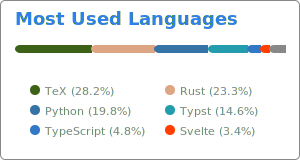

## Welcome to the GitHub profile of an Electronic Engineer with a programming problem

This repository contains a combination of private and work related projects. 

I would love to do everything in **Rust**, but that would not be practical, so it is mostly reserved for pet projects.
The **Python** projects are all work related and are for projects that have not yet moved to a work specific repository. Even though there are better languages available, when one works with scientists, Python end up being the best for future maintainability.

    

