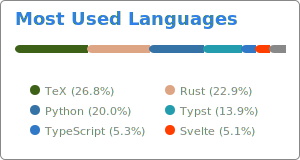

# Welcome to my GitHub profile.

I'm an Electronic Engineer that mostly write programs to monitor instrumentation and download data from such instruments. The data is then analysed, resulting a various data files, which leads to control logic for the instruments. Unfortunately, all the repos will be private.

Most of my work related programming is in Python. Course material is in LaTeX. I also dabble around with full stack frameworks for web sites that displays results based on the information retrieved and analysed from instrument.

I am currently learning Rust on the side.

---

    

---

Dynamic content in this file is generated from data retrieved using GitHub's GraphQL endpoint.  Graphs are updated daily.

