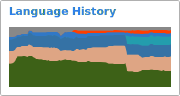

# Profile scripts

These script(s) queries the GitHub GraphQL endpoint. It requires a GitHub personal access token with metadata read permission, passed as an environmental variable called `PROFILE_TOKEN`, to be able to query private repositories. It is intended to run as part of a GitHub Action on a schedule or after a push to main.

## language.py

`language.py` creates two images (`lang.svg` and `history.svg`) and two data files (`lang_history.csv` and `colours.csv`). These images are shown below.

    
    

`lang.svg` shows the most used languages in the repository (up to eight). `history.svg` shows an area chart with the changes in the history chart.

The "Most Used Languages" image were inspired by images from [Anurag Hazra](https://github.com/anuraghazra) found on his [github-readme-stats](https://github.com/anuraghazra/github-readme-stats) page.

### Potential issues

None of these scripts have been extensively tested. It is unknown how the script will behave with few (or zero) languages, or with a small number of history entries. It will also (potentially) require a limit on the maximum amount of time.

## License

Copyright (c) 2024 Chris Matthee

Permission is hereby granted, free of charge, to any person obtaining a copy of
this software and associated documentation files (the "Software"), to deal in
the Software without restriction, including without limitation the rights to
use, copy, modify, merge, publish, distribute, sublicense, and/or sell copies
of the Software, and to permit persons to whom the Software is furnished to do
so, subject to the following conditions:

The above copyright notice and this permission notice shall be included in all
copies or substantial portions of the Software.

THE SOFTWARE IS PROVIDED "AS IS", WITHOUT WARRANTY OF ANY KIND, EXPRESS OR
IMPLIED, INCLUDING BUT NOT LIMITED TO THE WARRANTIES OF MERCHANTABILITY,
FITNESS FOR A PARTICULAR PURPOSE AND NONINFRINGEMENT. IN NO EVENT SHALL THE
AUTHORS OR COPYRIGHT HOLDERS BE LIABLE FOR ANY CLAIM, DAMAGES OR OTHER
LIABILITY, WHETHER IN AN ACTION OF CONTRACT, TORT OR OTHERWISE, ARISING FROM,
OUT OF OR IN CONNECTION WITH THE SOFTWARE OR THE USE OR OTHER DEALINGS IN THE
SOFTWARE.
