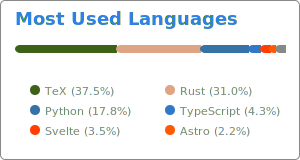
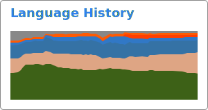

# Profile scripts

These script(s) queries the GitHub GraphQL endpoint. It requires a GitHub
personal access token with metadata read permission, passed as an environmental
variable called `PROFILE_TOKEN`, to be able to query private repositories. It
is intended to run as part of a GitHub Action on a schedule or after a push to
main.

## language.py

`language.py` creates two images (`lang.svg` and `history.svg`) and two data
files (`lang_history.csv` and `colours.csv`). These images are shown below.

    
    

`lang.svg` shows the most used languages in the repository (up to six).
`history.svg` shows an area chart with the changes in the history chart.

The "Most Used Languages" image were inspired by images from
[Anurag Hazra](https://github.com/anuraghazra) found on his
[github-readme-stats](https://github.com/anuraghazra/github-readme-stats) page.

### Potential issues

None of these scripts have been extensively tested. It is unknown how the
script will behave with few (or zero) languages, or with a small number of
history entries. It will also (potentially) require a limit on the maximum
amount of time.

## License

This is free and unencumbered software released into the public domain.

Anyone is free to copy, modify, publish, use, compile, sell, or
distribute this software, either in source code form or as a compiled
binary, for any purpose, commercial or non-commercial, and by any
means.

In jurisdictions that recognize copyright laws, the author or authors
of this software dedicate any and all copyright interest in the
software to the public domain. We make this dedication for the benefit
of the public at large and to the detriment of our heirs and
successors. We intend this dedication to be an overt act of
relinquishment in perpetuity of all present and future rights to this
software under copyright law.

THE SOFTWARE IS PROVIDED "AS IS", WITHOUT WARRANTY OF ANY KIND,
EXPRESS OR IMPLIED, INCLUDING BUT NOT LIMITED TO THE WARRANTIES OF
MERCHANTABILITY, FITNESS FOR A PARTICULAR PURPOSE AND NONINFRINGEMENT.
IN NO EVENT SHALL THE AUTHORS BE LIABLE FOR ANY CLAIM, DAMAGES OR
OTHER LIABILITY, WHETHER IN AN ACTION OF CONTRACT, TORT OR OTHERWISE,
ARISING FROM, OUT OF OR IN CONNECTION WITH THE SOFTWARE OR THE USE OR
OTHER DEALINGS IN THE SOFTWARE.

For more information, please refer to [http://unlicense.org/](http://unlicense.org/).
